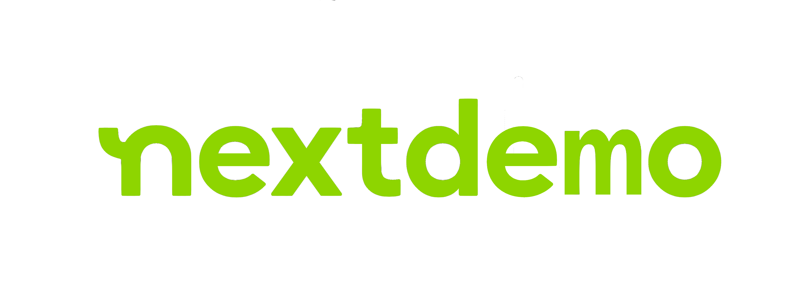
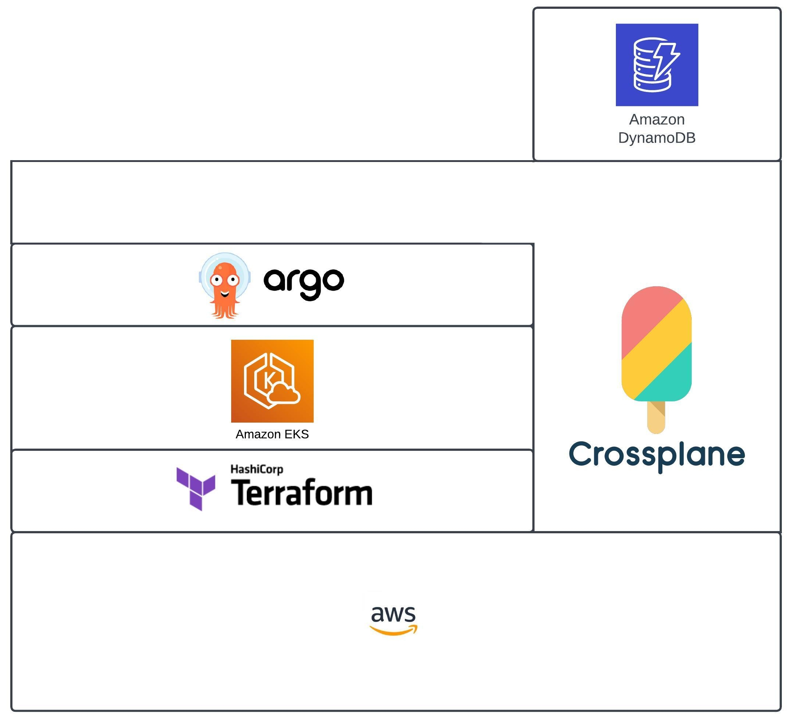

 

This repo is a technological microcosm. You have a locally built docker toolchain that shims domains atomically while using terraform to spin up a cluster with IRSA, creating least access iam roles which hand off to crossplane installed via helm, that then spins up a dynamodb table. It demonstrates a terse understanding of technology demarcation. I don't think you'll find many, if any such repos of such a terse demarcation. This is not meant to be an example of code quality.

The original goal was going to be a more fully fledged micro platform, demonstrating understanding from the nextdoor eng blog, but I lost a ton of time on argo and would say I prefer flux. This may just be because bitnamis version is strange. 

I wanted to demonstrate some understanding of sitevars, sidecars, and css but you can find some of that here:
https://hireryan.today/2021/08/13/custom-wordpress-theme-development/

There's only 2 requirements. Docker, and a functioning aws cli config. I'm sure you could export access vars as well, but that is an exercise left to the reader.

Step 1: Set your aws variables 
```
export REGION=
export K8_CLUSTER_SIZE=
export SUBNET_ARRAY=
export VPC_ID=
```
e.g.
```
export REGION=us-west-1
export K8_CLUSTER_SIZE=1
export SUBNET_ARRAY='["subnet-f535e4ad", "subnet-c336b5a7"]'
export VPC_ID=vpc-c58173a1
```

Then spin up a cluster and some data services
```
git clone https://github.com/rlewkowicz/nextdemo
cd nextdemo
docker run -v $(cd ~ && pwd)/.aws:/root/.aws -v $(pwd):/nextdemo -ti \
-e REGION=$REGION \
-e K8_CLUSTER_SIZE=$K8_CLUSTER_SIZE \
-e SUBNET_ARRAY="$SUBNET_ARRAY" \
-e VPC_ID=$VPC_ID \
hireryan/toolchain sh -c 'terraform init && terraform apply \
--var region=$REGION \
--var size=$K8_CLUSTER_SIZE \
--var subnet_ids="$SUBNET_ARRAY" \
--var vpc_id=$VPC_ID'
```
outcome: 
 